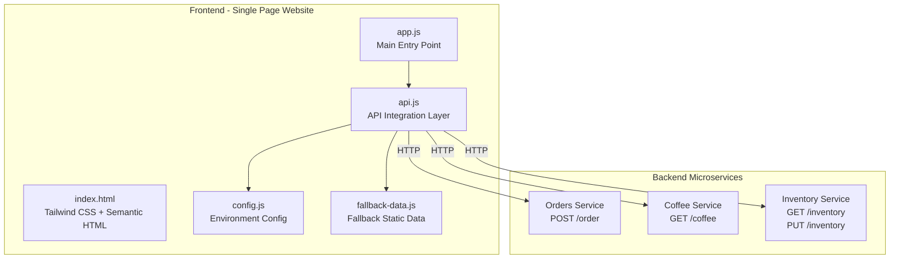
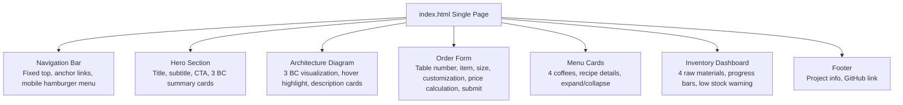

# Design Document: EventStorming Coffeeshop Showcase Website

## Overview

This design document describes the frontend architecture and implementation plan for the EventStorming Coffeeshop showcase website. The website is a single-page static application (HTML + Tailwind CSS + Vanilla JS) that integrates with three Java Spring Boot microservices (Orders, Coffee, Inventory), allowing visitors to interactively experience the coffee shop business flow built on DDD microservice architecture.

The website follows the defined design system (dark theme `#0F172A`, JetBrains Mono + IBM Plex Sans fonts, Vibrant & Block-based style) and uses Lucide Icons SVG icons. All API calls have fallback mechanisms to ensure static content is displayed when the backend is offline.

### Core Design Decisions

| Decision | Choice | Rationale |
|----------|--------|-----------|
| Framework | No framework (Vanilla JS) | Showcase website, no need for SPA framework complexity |
| Styling | Tailwind CSS CDN | Rapid development, direct mapping to design system colors |
| State Management | Modular global object | Simple and intuitive, no state management library needed |
| API Layer | Fetch wrapper + AbortController | Native support with timeout and retry mechanisms |
| Icons | Lucide Icons (inline SVG) | Consistency, lightweight, no external dependencies |
| Fallback | Static JSON fallback | Full UI display when backend is offline |

---

## Architecture

### High-Level Architecture Diagram



### Backend API Endpoint Mapping (from actual backend code)

| Microservice | Endpoint | Method | Description | Backend Controller |
|-------------|----------|--------|-------------|-------------------|
| Orders | `/order` | POST | Create order | `OrderResource.createOrder()` |
| Coffee | `/coffee` | GET | Get coffee item list | `CoffeeResource.listCoffees()` |
| Inventory | `/inventory` | GET | Get inventory status | `InventoryResource.sayHello()` |
| Inventory | `/inventory` | PUT | Deduct inventory | `InventoryResource.takeOut()` |

> **Note:** The backend Coffee and Inventory APIs currently have simplified implementations (returning strings). The frontend design targets complete data structures, paired with fallback data to ensure showcase quality.

---

## Components and Interfaces

### File Structure

```
website/
├── index.html              # Main page (all sections)
├── css/
│   └── custom.css          # Custom styles (CSS variables, glassmorphism, animations)
├── js/
│   ├── config.js           # API base URL configuration
│   ├── api.js              # Fetch wrapper (timeout, retry, logging)
│   ├── fallback-data.js    # Fallback static data
│   ├── app.js              # Main program (initialization, event binding)
│   ├── components/
│   │   ├── navigation.js   # Navigation bar interactions (scroll highlight, mobile menu)
│   │   ├── hero.js         # Hero section dynamic effects
│   │   ├── architecture.js # Architecture diagram interactions (hover highlight)
│   │   ├── order-form.js   # Order form logic (item selection, price calculation, submission)
│   │   ├── menu.js         # Menu cards (loading, detail expansion)
│   │   └── inventory.js    # Inventory dashboard (loading, progress bar updates)
│   └── utils/
│       └── dom.js          # DOM utility functions (skeleton loading, error messages)
└── assets/
    └── images/             # Downloaded product images
        ├── espresso.jpg
        ├── americano.jpg
        ├── latte.jpg
        ├── cappuccino.jpg
        ├── coffee-beans.jpg
        ├── milk.jpg
        └── hero-coffeeshop.jpg
```

### Component Decomposition



### Component Interface Definitions

#### Navigation (navigation.js)

```javascript
// Initialize navigation bar behavior
function initNavigation() → void
// Update active anchor highlight on scroll
function updateActiveSection() → void
// Toggle mobile hamburger menu
function toggleMobileMenu() → void
```

#### Order Form (order-form.js)

```javascript
// Initialize order form
function initOrderForm() → void
// Update size and customization options based on selected coffee item
function updateSizeOptions(productId: string) → void
// Update customization options based on selected item (foam, soy milk, whipped cream)
function updateCustomizations(productId: string) → void
// Calculate order total in real-time
function calculateTotal() → number
// Submit order to Orders Service
async function submitOrder() → OrderResponse | Error
// Display order result (success/failure)
function showOrderResult(result: OrderResponse | Error) → void
```

#### Menu (menu.js)

```javascript
// Load coffee item data (API or fallback)
async function loadMenuData() → CoffeeItem[]
// Render menu cards
function renderMenuCards(items: CoffeeItem[]) → void
// Toggle card expand/collapse
function toggleCardDetail(cardElement: HTMLElement) → void
```

#### Inventory (inventory.js)

```javascript
// Load inventory data (API or fallback)
async function loadInventoryData() → InventoryItem[]
// Render inventory dashboard
function renderInventoryDashboard(items: InventoryItem[]) → void
// Update progress bar color (warning color below 30%)
function updateStockIndicator(element: HTMLElement, percentage: number) → void
```

#### API Layer (api.js)

```javascript
// Generic fetch wrapper with timeout (10s), logging, error handling
async function apiFetch(url: string, options?: RequestInit) → Response
// Create order
async function createOrder(orderData: AddOrderRequest) → OrderResponse
// Get coffee item list
async function fetchCoffeeMenu() → CoffeeItem[]
// Get inventory status
async function fetchInventory() → InventoryItem[]
```

#### DOM Utils (dom.js)

```javascript
// Show skeleton loading placeholder
function showSkeleton(containerId: string) → void
// Hide skeleton loading placeholder
function hideSkeleton(containerId: string) → void
// Show error message with retry button
function showError(containerId: string, message: string, retryFn: Function) → void
// Hide error message
function hideError(containerId: string) → void
```

---

## Data Models

The following data models are based on actual backend Java source code definitions, mapped to frontend JavaScript object structures.

### API Configuration (config.js)

```javascript
/** @type {ApiConfig} */
const API_CONFIG = {
  orders: {
    baseUrl: 'http://localhost:8081',  // Orders Service
    endpoints: { create: '/order' }
  },
  coffee: {
    baseUrl: 'http://localhost:8082',  // Coffee Service
    endpoints: { list: '/coffee' }
  },
  inventory: {
    baseUrl: 'http://localhost:8083',  // Inventory Service
    endpoints: { list: '/inventory' }
  },
  timeout: 10000  // 10-second timeout
};
```

### Order Related (maps to backend `AddOrderReq`, `OrderRst`)

```javascript
/**
 * Create order request
 * Maps to backend: solid.humank.coffeeshop.order.models.requests.AddOrderReq
 * @typedef {Object} AddOrderRequest
 * @property {OrderItemRequest[]} items - Order item list
 */

/**
 * Order item request
 * Maps to backend: solid.humank.coffeeshop.order.models.requests.OrderItemRM
 * @typedef {Object} OrderItemRequest
 * @property {string} productId  - Coffee item ID (e.g. "espresso", "americano")
 * @property {number} qty        - Quantity
 * @property {number} price      - Unit price (BigDecimal -> number)
 */

/**
 * Order response
 * Maps to backend: solid.humank.coffeeshop.order.datacontracts.results.OrderRst
 * @typedef {Object} OrderResponse
 * @property {string} id            - Order number (format: yyyyMMddHHmmss-uuid)
 * @property {number} status        - Order status (0=INITIAL, 1=PROCESSING, 2=DELIVER, 3=CLOSED, 4=CANCEL)
 * @property {OrderItemResponse[]} items - Order items
 * @property {string} createdDate   - Creation time (ISO 8601)
 * @property {string} modifiedDate  - Modification time (ISO 8601)
 */

/**
 * Order item response
 * Maps to backend: solid.humank.coffeeshop.order.datacontracts.results.OrderItemRst
 * @typedef {Object} OrderItemResponse
 * @property {string} productId - Item ID
 * @property {number} qty       - Quantity
 * @property {number} price     - Unit price
 * @property {number} fee       - Subtotal (price x qty)
 */

/**
 * Generic API response wrapper
 * Maps to backend: CommonResponse
 * @typedef {Object} ApiResponse
 * @property {*} data - Response data (OrderRst on success, error message string on failure)
 */
```

### Order Status Enum (maps to backend `OrderStatus`)

```javascript
/** Maps to backend: solid.humank.coffeeshop.order.models.OrderStatus */
const ORDER_STATUS = {
  INITIAL: 0,
  PROCESSING: 1,
  DELIVER: 2,
  CLOSED: 3,
  CANCEL: 4
};
```

### Coffee Items (frontend defined, with fallback data)

```javascript
/**
 * Coffee menu item
 * Frontend extended model; backend CoffeeResource currently returns simplified data
 * @typedef {Object} CoffeeMenuItem
 * @property {string} id          - Item ID
 * @property {string} name        - Item name
 * @property {string} image       - Image path
 * @property {SizeOption[]} sizes - Size options
 * @property {Recipe} recipe      - Preparation recipe
 * @property {Customization[]} customizations - Customization options
 */

/**
 * Size option
 * @typedef {Object} SizeOption
 * @property {string} size   - Size name (Single/Double/Short/Tall/Grande/Venti)
 * @property {number} ml     - Volume (milliliters)
 * @property {number} price  - Price (TWD)
 */

/**
 * Preparation recipe
 * @typedef {Object} Recipe
 * @property {number} espressoShots - Espresso shot count
 * @property {number} milkMl        - Milk volume (ml)
 * @property {number} waterMl       - Water volume (ml)
 * @property {string} [foam]        - Foam type
 */

/**
 * Customization option
 * @typedef {Object} Customization
 * @property {string} id      - Option ID
 * @property {string} label   - Display name
 * @property {string} type    - Type ("select" | "toggle")
 * @property {CustomizationChoice[]} choices - Available choices
 */
```

### Inventory (frontend defined, with fallback data)

```javascript
/**
 * Inventory item
 * Frontend extended model; backend InventoryResource currently returns simplified data
 * @typedef {Object} InventoryItem
 * @property {string} id          - Raw material ID
 * @property {string} name        - Raw material name
 * @property {string} unit        - Unit (bottle, bag, pack)
 * @property {number} current     - Current quantity
 * @property {number} max         - Maximum capacity
 * @property {string} [image]     - Image path
 */
```

### Frontend State Model

```javascript
/**
 * Global application state
 * @typedef {Object} AppState
 * @property {Object} order          - Current order state
 * @property {string} order.tableNo  - Selected table number
 * @property {string} order.productId - Selected coffee item
 * @property {string} order.size     - Selected size
 * @property {Object} order.customizations - Customization options
 * @property {number} order.total    - Order total
 * @property {CoffeeMenuItem[]} menu - Coffee menu data
 * @property {InventoryItem[]} inventory - Inventory data
 * @property {Object} loading        - Loading state per section
 * @property {Object} errors         - Error state per section
 */
```

### Coffee Item Static Data (fallback-data.js)

The following static data is used for the fallback mechanism, corresponding to the items and prices defined in Requirement 4:

```javascript
const FALLBACK_MENU = [
  {
    id: 'espresso',
    name: 'Espresso',
    image: 'assets/images/espresso.jpg',
    sizes: [
      { size: 'Single', ml: 30, price: 60 },
      { size: 'Double', ml: 60, price: 80 }
    ],
    recipe: { espressoShots: 1, milkMl: 0, waterMl: 0 },
    customizations: []
  },
  {
    id: 'americano',
    name: 'Caffe Americano',
    image: 'assets/images/americano.jpg',
    sizes: [
      { size: 'Short', ml: 240, price: 80 },
      { size: 'Tall', ml: 360, price: 100 },
      { size: 'Grande', ml: 480, price: 120 },
      { size: 'Venti', ml: 600, price: 140 }
    ],
    recipe: { espressoShots: 2, milkMl: 0, waterMl: 200 },
    customizations: []
  },
  {
    id: 'latte',
    name: 'Caffe Latte',
    image: 'assets/images/latte.jpg',
    sizes: [
      { size: 'Short', ml: 240, price: 100 },
      { size: 'Tall', ml: 360, price: 120 },
      { size: 'Grande', ml: 480, price: 140 },
      { size: 'Venti', ml: 600, price: 160 }
    ],
    recipe: { espressoShots: 2, milkMl: 180, waterMl: 0, foam: 'Regular foam' },
    customizations: [
      {
        id: 'foam',
        label: 'Foam Options',
        type: 'select',
        choices: [
          { value: 'none', label: 'No Foam', priceAdjust: 0 },
          { value: 'normal', label: 'Regular Foam', priceAdjust: 0 },
          { value: 'extra', label: 'Extra Foam', priceAdjust: 0 }
        ]
      },
      {
        id: 'soy',
        label: 'Soy Milk Substitute',
        type: 'toggle',
        choices: [
          { value: false, label: 'Regular Milk', priceAdjust: 0 },
          { value: true, label: 'Soy Milk Substitute', priceAdjust: 0 }
        ]
      }
    ]
  },
  {
    id: 'cappuccino',
    name: 'Cappuccino',
    image: 'assets/images/cappuccino.jpg',
    sizes: [
      { size: 'Short', ml: 240, price: 100 },
      { size: 'Tall', ml: 360, price: 120 },
      { size: 'Grande', ml: 480, price: 140 },
      { size: 'Venti', ml: 600, price: 160 }
    ],
    recipe: { espressoShots: 2, milkMl: 120, waterMl: 0, foam: 'Thick foam' },
    customizations: [
      {
        id: 'foamType',
        label: 'Foam Type',
        type: 'select',
        choices: [
          { value: 'dry', label: 'Dry Foam', priceAdjust: 0 },
          { value: 'wet', label: 'Wet Foam', priceAdjust: 0 }
        ]
      },
      {
        id: 'whippedCream',
        label: 'Whipped Cream Add-on',
        type: 'toggle',
        choices: [
          { value: false, label: 'None', priceAdjust: 0 },
          { value: true, label: 'Add Whipped Cream', priceAdjust: 20 }
        ]
      },
      {
        id: 'soy',
        label: 'Soy Milk Substitute',
        type: 'toggle',
        choices: [
          { value: false, label: 'Regular Milk', priceAdjust: 0 },
          { value: true, label: 'Soy Milk Substitute', priceAdjust: 0 }
        ]
      }
    ]
  }
];

const FALLBACK_INVENTORY = [
  { id: 'soymilk', name: 'Soy Milk', unit: 'bottles', current: 20, max: 50, image: 'assets/images/milk.jpg' },
  { id: 'milk', name: 'Milk', unit: 'bottles', current: 50, max: 100, image: 'assets/images/milk.jpg' },
  { id: 'beans', name: 'Coffee Beans', unit: 'bags', current: 100, max: 200, image: 'assets/images/coffee-beans.jpg' },
  { id: 'filter', name: 'Filter Paper', unit: 'packs', current: 200, max: 500 }
];
```

### Responsive Layout Strategy

| Breakpoint | Width | Layout Adjustment |
|-----------|-------|-------------------|
| Mobile | < 768px | Single column, hamburger menu, stacked cards, full-width form |
| Tablet | 768px - 1023px | Two-column cards, collapsed side navigation |
| Desktop | 1024px - 1439px | Three-column cards, full navigation bar |
| Wide | >= 1440px | max-w-7xl centered, four-column inventory cards |

Tailwind breakpoint mapping: `sm:640px`, `md:768px`, `lg:1024px`, `xl:1280px`, `2xl:1536px`

### State Management Approach

Uses a modular global object for state management; components update UI via event-driven patterns:

```javascript
// Global state in app.js
const state = {
  order: { tableNo: '', productId: '', size: '', customizations: {}, total: 0 },
  menu: [],
  inventory: [],
  loading: { menu: false, inventory: false, order: false },
  errors: { menu: null, inventory: null, order: null }
};

// Trigger UI re-render after state update
function updateState(section, data) {
  Object.assign(state[section], data);
  renderSection(section);
}
```


---

## Correctness Properties

*A property is a characteristic or behavior that should hold across all valid executions of a system — essentially a formalized statement of what the system should do. Properties serve as a bridge between human-readable specifications and machine-verifiable correctness guarantees.*

### Property 1: Clickable elements have interactive feedback

*For any* clickable element on the page (buttons, links, cards), the element should have `cursor: pointer` style, and its `transition-duration` value should be between 150ms and 300ms.

**Validates: Requirements 1.4**

### Property 2: All sections use consistent max-width container

*For any* content section on the page, its direct child container should include the `max-w-7xl` class.

**Validates: Requirements 1.7**

### Property 3: Non-Espresso items display four standard sizes

*For any* non-Espresso coffee item (Americano, Latte, Cappuccino), calling `updateSizeOptions(productId)` should return exactly Short, Tall, Grande, and Venti size options.

**Validates: Requirements 4.4**

### Property 4: Order total calculation is correct

*For any* valid order combination (item, size, customization options), the result of `calculateTotal()` should equal the selected size's base price plus the sum of all customization option price adjustments.

**Validates: Requirements 4.7**

### Property 5: Order submission request format is correct

*For any* valid order state (containing productId, qty, price), the request body constructed by `submitOrder()` should conform to the backend `AddOrderReq` format: containing an `items` array where each element has `productId` (string), `qty` (number), and `price` (number) fields.

**Validates: Requirements 4.8**

### Property 6: API errors display error message and retry button

*For any* failed API request (including HTTP 4xx/5xx errors and network errors), the corresponding UI section should display a user-friendly error message and include a clickable retry button.

**Validates: Requirements 4.10, 7.4**

### Property 7: Menu cards display complete information

*For any* coffee item data (CoffeeMenuItem), the rendered Menu_Card should contain the item name, all size volumes (ml) and prices, and recipe information (espresso shots, milk volume, water volume).

**Validates: Requirements 5.2, 5.3**

### Property 8: Menu card expand/collapse toggle

*For any* Menu_Card element, clicking once should expand to show full recipe details, clicking again should collapse back to the original state.

**Validates: Requirements 5.4**

### Property 9: API failure uses fallback data

*For any* failed API request (Coffee Service or Inventory Service), the corresponding section should render using fallback static data, and the rendered result should have the same structure as when using API data.

**Validates: Requirements 5.7, 6.6**

### Property 10: Inventory dashboard displays complete info with correct percentages

*For any* inventory item (InventoryItem), the dashboard should display the raw material name, current quantity, and maximum capacity, and the progress bar width percentage should equal `(current / max) * 100`.

**Validates: Requirements 6.2, 6.7**

### Property 11: Low stock warning color

*For any* inventory item, when `current / max < 0.3`, the Stock_Indicator progress bar should use a warning color (red or orange); when `current / max >= 0.3`, it should use the normal color.

**Validates: Requirements 6.3**

### Property 12: API request timeout handling

*For any* API request, if the response time exceeds 10 seconds, `apiFetch()` should abort the request (AbortController) and throw a timeout error.

**Validates: Requirements 7.3**

### Property 13: API loading state indicator

*For any* in-progress API request, the corresponding UI section should display a Loading_Skeleton placeholder; after the request completes, the skeleton should be removed.

**Validates: Requirements 7.2**

### Property 14: API request logging

*For any* API request (whether successful or failed), `apiFetch()` should log summary information including request URL, method, and response status code in the browser console.

**Validates: Requirements 7.5**

### Property 15: All images have alt text

*For any* `` element on the page, it should have a non-empty `alt` attribute.

**Validates: Requirements 8.2**

### Property 16: All form inputs have associated labels

*For any* form input element (`<input>`, `<select>`) on the page, it should have an associated `<label>` element linked via `for`/`id`.

**Validates: Requirements 8.3**

### Property 17: No emoji used as icons

*For any* element used as an icon on the page, it should be an SVG element and should not contain emoji characters (Unicode Emoji range).

**Validates: Requirements 8.7**

---

## Error Handling

### API Error Handling Strategy

| Error Type | Handling | User Experience |
|-----------|---------|-----------------|
| Network error (unreachable) | Use fallback static data + show retry button | Can still browse static content |
| HTTP 4xx (client error) | Show specific error message + retry button | Prompt user to correct input |
| HTTP 5xx (server error) | Show generic error message + retry button | Prompt to try again later |
| Timeout (> 10 seconds) | AbortController abort + show timeout message + retry button | Prompt about possible network instability |
| JSON parse error | Use fallback static data + console log | Seamless degradation |

### Error Message Templates

```javascript
const ERROR_MESSAGES = {
  network: 'Unable to connect to server. Currently showing default data.',
  timeout: 'Request timed out. Please check your network connection and retry.',
  orderFailed: 'Order creation failed. Please try again later.',
  serverError: 'Server error occurred. Please try again later.',
  unknown: 'An unexpected error occurred. Please refresh the page.'
};
```

### Fallback Flow

```mermaid
flowchart TD
    A[Initiate API Request] --> B{Request Successful?}
    B -->|Yes| C[Render with API response data]
    B -->|No| D{Is it a GET request?}
    D -->|Yes| E[Render with fallback static data]
    D -->|No| F[Show error message + retry button]
    E --> G[Show "Currently in offline mode" notice]
```

---

## Testing Strategy

### Dual-Track Testing Approach

This project uses unit tests and property-based tests in parallel to ensure comprehensive coverage.

### Property-Based Testing

- **Testing library:** [fast-check](https://github.com/dubzzz/fast-check) (JavaScript PBT library)
- **Minimum iterations:** Each property test runs at least 100 times
- **Tag format:** `Feature: coffeeshop-showcase-website, Property {number}: {property_text}`

Each correctness property (Property 1-17) maps to a property-based test using fast-check to generate random inputs and verify the property holds.

#### Property Test Example

```javascript
import fc from 'fast-check';

// Feature: coffeeshop-showcase-website, Property 4: Order total calculation is correct
test('calculateTotal returns base price + customization adjustments', () => {
  fc.assert(
    fc.property(
      fc.record({
        basePrice: fc.integer({ min: 30, max: 200 }),
        adjustments: fc.array(fc.integer({ min: 0, max: 50 }), { maxLength: 5 })
      }),
      ({ basePrice, adjustments }) => {
        const expected = basePrice + adjustments.reduce((sum, a) => sum + a, 0);
        // ... call calculateTotal and verify
        return true;
      }
    ),
    { numRuns: 100 }
  );
});
```

### Unit Tests

- **Testing framework:** Vitest
- **Key coverage:**
  - Specific examples: Espresso only shows Single/Double (Req 4.3), Latte customization options (Req 4.5), Cappuccino customization options (Req 4.6)
  - Edge cases: Empty order submission, inventory exactly at 30% boundary
  - Integration points: API config switching (Req 7.1), semantic HTML structure (Req 8.6)
  - Specific UI states: Order success response showing order number (Req 4.9), Hero section title text (Req 2.1)

### Test File Structure

```
website/
└── tests/
    ├── unit/
    │   ├── order-form.test.js    # Order form unit tests
    │   ├── menu.test.js          # Menu component unit tests
    │   ├── inventory.test.js     # Inventory component unit tests
    │   ├── api.test.js           # API layer unit tests
    │   └── dom.test.js           # DOM utility unit tests
    └── property/
        ├── order-calc.property.js    # Property 4, 5
        ├── menu-render.property.js   # Property 7, 8
        ├── inventory.property.js     # Property 10, 11
        ├── api-layer.property.js     # Property 6, 9, 12, 13, 14
        └── a11y.property.js          # Property 15, 16, 17
```
