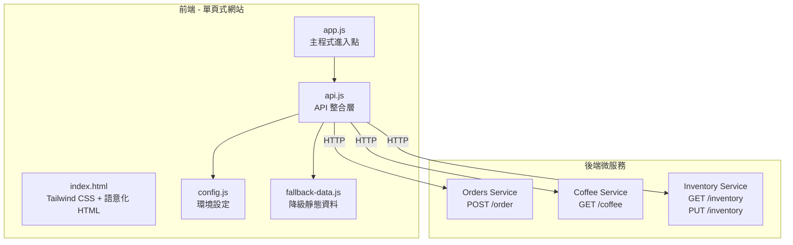
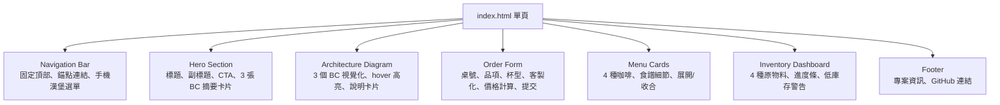
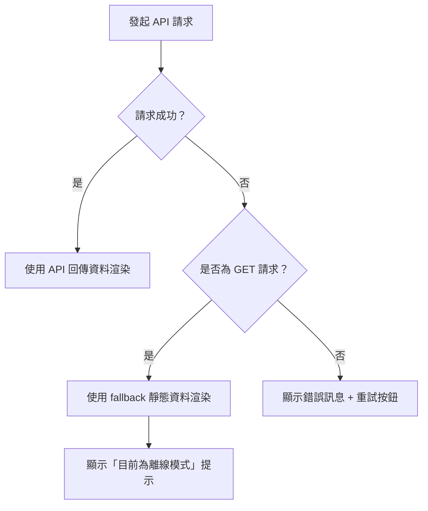

# 設計文件：EventStorming Coffeeshop 展示網站

## 概述

本設計文件描述 EventStorming Coffeeshop 展示網站的前端架構與實作方案。網站為單頁式靜態應用（HTML + Tailwind CSS + Vanilla JS），串接三個 Java Spring Boot 微服務（Orders、Coffee、Inventory），讓訪客能互動體驗 DDD 微服務架構的咖啡店業務流程。

網站遵循已定義的設計系統（深色主題 `#0F172A`、JetBrains Mono + IBM Plex Sans 字型、Vibrant & Block-based 風格），並使用 Lucide Icons SVG 圖示。所有 API 呼叫皆具備降級方案（fallback data），確保後端離線時仍可展示靜態內容。

### 核心設計決策

| 決策 | 選擇 | 理由 |
|------|------|------|
| 框架 | 無框架（Vanilla JS） | 展示型網站，無需 SPA 框架的複雜度 |
| 樣式 | Tailwind CSS CDN | 快速開發，與設計系統色彩直接對應 |
| 狀態管理 | 模組化全域物件 | 簡單直覺，無需狀態管理庫 |
| API 層 | Fetch wrapper + AbortController | 原生支援，含逾時與重試機制 |
| 圖示 | Lucide Icons（inline SVG） | 一致性、輕量、無外部依賴 |
| 降級方案 | 靜態 JSON fallback | 後端離線時仍可展示完整 UI |

---

## 架構

### 高層架構圖



### 後端 API 端點對應（源自實際後端程式碼）

| 微服務 | 端點 | 方法 | 說明 | 後端 Controller |
|--------|------|------|------|-----------------|
| Orders | `/order` | POST | 建立訂單 | `OrderResource.createOrder()` |
| Coffee | `/coffee` | GET | 取得咖啡品項列表 | `CoffeeResource.listCoffees()` |
| Inventory | `/inventory` | GET | 取得庫存狀態 | `InventoryResource.sayHello()` |
| Inventory | `/inventory` | PUT | 扣減庫存 | `InventoryResource.takeOut()` |

> **備註：** 後端 Coffee 與 Inventory 的 API 目前為簡化實作（回傳字串），前端設計以完整資料結構為目標，搭配 fallback data 確保展示效果。

---

## 元件與介面

### 檔案結構

```
website/
├── index.html              # 主頁面（所有區塊）
├── css/
│   └── custom.css          # 自訂樣式（CSS 變數、glassmorphism、動畫）
├── js/
│   ├── config.js           # API 基礎位址設定
│   ├── api.js              # Fetch wrapper（逾時、重試、日誌）
│   ├── fallback-data.js    # 降級靜態資料
│   ├── app.js              # 主程式（初始化、事件綁定）
│   ├── components/
│   │   ├── navigation.js   # 導覽列互動（滾動高亮、手機選單）
│   │   ├── hero.js         # Hero 區塊動態效果
│   │   ├── architecture.js # 架構圖互動（hover 高亮）
│   │   ├── order-form.js   # 點餐表單邏輯（品項選擇、價格計算、提交）
│   │   ├── menu.js         # 菜單卡片（載入、展開細節）
│   │   └── inventory.js    # 庫存儀表板（載入、進度條更新）
│   └── utils/
│       └── dom.js          # DOM 工具函式（骨架載入、錯誤訊息）
└── assets/
    └── images/             # 已下載的產品圖片
        ├── espresso.jpg
        ├── americano.jpg
        ├── latte.jpg
        ├── cappuccino.jpg
        ├── coffee-beans.jpg
        ├── milk.jpg
        └── hero-coffeeshop.jpg
```

### 元件分解



### 元件介面定義

#### Navigation（navigation.js）

```javascript
// 初始化導覽列行為
function initNavigation() → void
// 更新滾動時的 active 錨點高亮
function updateActiveSection() → void
// 切換手機版漢堡選單
function toggleMobileMenu() → void
```

#### Order Form（order-form.js）

```javascript
// 初始化點餐表單
function initOrderForm() → void
// 根據選擇的咖啡品項更新杯型與客製化選項
function updateSizeOptions(productId: string) → void
// 根據選擇的品項更新客製化選項（奶泡、豆漿、鮮奶油）
function updateCustomizations(productId: string) → void
// 即時計算訂單總金額
function calculateTotal() → number
// 提交訂單至 Orders Service
async function submitOrder() → OrderResponse | Error
// 顯示訂單結果（成功/失敗）
function showOrderResult(result: OrderResponse | Error) → void
```

#### Menu（menu.js）

```javascript
// 載入咖啡品項資料（API 或 fallback）
async function loadMenuData() → CoffeeItem[]
// 渲染菜單卡片
function renderMenuCards(items: CoffeeItem[]) → void
// 切換卡片展開/收合
function toggleCardDetail(cardElement: HTMLElement) → void
```

#### Inventory（inventory.js）

```javascript
// 載入庫存資料（API 或 fallback）
async function loadInventoryData() → InventoryItem[]
// 渲染庫存儀表板
function renderInventoryDashboard(items: InventoryItem[]) → void
// 更新進度條顏色（低於 30% 顯示警告色）
function updateStockIndicator(element: HTMLElement, percentage: number) → void
```

#### API Layer（api.js）

```javascript
// 通用 fetch wrapper，含逾時（10 秒）、日誌、錯誤處理
async function apiFetch(url: string, options?: RequestInit) → Response
// 建立訂單
async function createOrder(orderData: AddOrderRequest) → OrderResponse
// 取得咖啡品項列表
async function fetchCoffeeMenu() → CoffeeItem[]
// 取得庫存狀態
async function fetchInventory() → InventoryItem[]
```

#### DOM Utils（dom.js）

```javascript
// 顯示骨架載入佔位元件
function showSkeleton(containerId: string) → void
// 隱藏骨架載入佔位元件
function hideSkeleton(containerId: string) → void
// 顯示錯誤訊息與重試按鈕
function showError(containerId: string, message: string, retryFn: Function) → void
// 隱藏錯誤訊息
function hideError(containerId: string) → void
```

---

## 資料模型

以下資料模型基於實際後端 Java 原始碼定義，對應前端 JavaScript 物件結構。

### API 設定（config.js）

```javascript
/** @type {ApiConfig} */
const API_CONFIG = {
  orders: {
    baseUrl: 'http://localhost:8081',  // Orders Service
    endpoints: { create: '/order' }
  },
  coffee: {
    baseUrl: 'http://localhost:8082',  // Coffee Service
    endpoints: { list: '/coffee' }
  },
  inventory: {
    baseUrl: 'http://localhost:8083',  // Inventory Service
    endpoints: { list: '/inventory' }
  },
  timeout: 10000  // 10 秒逾時
};
```

### 訂單相關（對應後端 `AddOrderReq`、`OrderRst`）

```javascript
/**
 * 建立訂單請求
 * 對應後端：solid.humank.coffeeshop.order.models.requests.AddOrderReq
 * @typedef {Object} AddOrderRequest
 * @property {OrderItemRequest[]} items - 訂單品項列表
 */

/**
 * 訂單品項請求
 * 對應後端：solid.humank.coffeeshop.order.models.requestsmodels.OrderItemRM
 * @typedef {Object} OrderItemRequest
 * @property {string} productId  - 咖啡品項 ID（如 "espresso", "americano"）
 * @property {number} qty        - 數量
 * @property {number} price      - 單價（BigDecimal → number）
 */

/**
 * 訂單回應
 * 對應後端：solid.humank.coffeeshop.order.datacontracts.results.OrderRst
 * @typedef {Object} OrderResponse
 * @property {string} id            - 訂單編號（格式：yyyyMMddHHmmss-uuid）
 * @property {number} status        - 訂單狀態（0=INITIAL, 1=PROCESSING, 2=DELIVER, 3=CLOSED, 4=CANCEL）
 * @property {OrderItemResponse[]} items - 訂單品項
 * @property {string} createdDate   - 建立時間（ISO 8601）
 * @property {string} modifiedDate  - 修改時間（ISO 8601）
 */

/**
 * 訂單品項回應
 * 對應後端：solid.humank.coffeeshop.order.datacontracts.results.OrderItemRst
 * @typedef {Object} OrderItemResponse
 * @property {string} productId - 品項 ID
 * @property {number} qty       - 數量
 * @property {number} price     - 單價
 * @property {number} fee       - 小計（price × qty）
 */

/**
 * 通用 API 回應包裝
 * 對應後端：CommonResponse
 * @typedef {Object} ApiResponse
 * @property {*} data - 回應資料（成功時為 OrderRst，失敗時為錯誤訊息字串）
 */
```

### 訂單狀態列舉（對應後端 `OrderStatus`）

```javascript
/** 對應後端：solid.humank.coffeeshop.order.models.OrderStatus */
const ORDER_STATUS = {
  INITIAL: 0,
  PROCESSING: 1,
  DELIVER: 2,
  CLOSED: 3,
  CANCEL: 4
};
```

### 咖啡品項（前端定義，搭配 fallback data）

```javascript
/**
 * 咖啡品項
 * 前端擴展模型，後端 CoffeeResource 目前回傳簡化資料
 * @typedef {Object} CoffeeMenuItem
 * @property {string} id          - 品項 ID
 * @property {string} name        - 品項名稱
 * @property {string} image       - 圖片路徑
 * @property {SizeOption[]} sizes - 杯型選項
 * @property {Recipe} recipe      - 製作食譜
 * @property {Customization[]} customizations - 客製化選項
 */

/**
 * 杯型選項
 * @typedef {Object} SizeOption
 * @property {string} size   - 杯型名稱（Single/Double/Short/Tall/Grande/Venti）
 * @property {number} ml     - 容量（毫升）
 * @property {number} price  - 價格（新台幣）
 */

/**
 * 製作食譜
 * @typedef {Object} Recipe
 * @property {number} espressoShots - espresso shot 數量
 * @property {number} milkMl        - 牛奶用量（ml）
 * @property {number} waterMl       - 水量（ml）
 * @property {string} [foam]        - 奶泡類型
 */

/**
 * 客製化選項
 * @typedef {Object} Customization
 * @property {string} id      - 選項 ID
 * @property {string} label   - 顯示名稱
 * @property {string} type    - 類型（"select" | "toggle"）
 * @property {CustomizationChoice[]} choices - 可選值
 */
```

### 庫存（前端定義，搭配 fallback data）

```javascript
/**
 * 庫存品項
 * 前端擴展模型，後端 InventoryResource 目前回傳簡化資料
 * @typedef {Object} InventoryItem
 * @property {string} id          - 原物料 ID
 * @property {string} name        - 原物料名稱
 * @property {string} unit        - 單位（瓶、袋、包）
 * @property {number} current     - 目前數量
 * @property {number} max         - 最大容量
 * @property {string} [image]     - 圖片路徑
 */
```

### 前端狀態模型

```javascript
/**
 * 全域應用程式狀態
 * @typedef {Object} AppState
 * @property {Object} order          - 當前點餐狀態
 * @property {string} order.tableNo  - 選擇的桌號
 * @property {string} order.productId - 選擇的咖啡品項
 * @property {string} order.size     - 選擇的杯型
 * @property {Object} order.customizations - 客製化選項
 * @property {number} order.total    - 訂單總金額
 * @property {CoffeeMenuItem[]} menu - 咖啡菜單資料
 * @property {InventoryItem[]} inventory - 庫存資料
 * @property {Object} loading        - 各區塊載入狀態
 * @property {Object} errors         - 各區塊錯誤狀態
 */
```

### 咖啡品項靜態資料（fallback-data.js）

以下為降級方案使用的靜態資料，對應需求 4 的品項與價格定義：

```javascript
const FALLBACK_MENU = [
  {
    id: 'espresso',
    name: 'Espresso',
    image: 'assets/images/espresso.jpg',
    sizes: [
      { size: 'Single', ml: 30, price: 60 },
      { size: 'Double', ml: 60, price: 80 }
    ],
    recipe: { espressoShots: 1, milkMl: 0, waterMl: 0 },
    customizations: []
  },
  {
    id: 'americano',
    name: 'Caffe Americano',
    image: 'assets/images/americano.jpg',
    sizes: [
      { size: 'Short', ml: 240, price: 80 },
      { size: 'Tall', ml: 360, price: 100 },
      { size: 'Grande', ml: 480, price: 120 },
      { size: 'Venti', ml: 600, price: 140 }
    ],
    recipe: { espressoShots: 2, milkMl: 0, waterMl: 200 },
    customizations: []
  },
  {
    id: 'latte',
    name: 'Caffe Latte',
    image: 'assets/images/latte.jpg',
    sizes: [
      { size: 'Short', ml: 240, price: 100 },
      { size: 'Tall', ml: 360, price: 120 },
      { size: 'Grande', ml: 480, price: 140 },
      { size: 'Venti', ml: 600, price: 160 }
    ],
    recipe: { espressoShots: 2, milkMl: 180, waterMl: 0, foam: '一般奶泡' },
    customizations: [
      {
        id: 'foam',
        label: '奶泡選項',
        type: 'select',
        choices: [
          { value: 'none', label: '無奶泡', priceAdjust: 0 },
          { value: 'normal', label: '一般奶泡', priceAdjust: 0 },
          { value: 'extra', label: '多奶泡', priceAdjust: 0 }
        ]
      },
      {
        id: 'soy',
        label: '豆漿替代',
        type: 'toggle',
        choices: [
          { value: false, label: '鮮奶', priceAdjust: 0 },
          { value: true, label: '豆漿替代', priceAdjust: 0 }
        ]
      }
    ]
  },
  {
    id: 'cappuccino',
    name: 'Cappuccino',
    image: 'assets/images/cappuccino.jpg',
    sizes: [
      { size: 'Short', ml: 240, price: 100 },
      { size: 'Tall', ml: 360, price: 120 },
      { size: 'Grande', ml: 480, price: 140 },
      { size: 'Venti', ml: 600, price: 160 }
    ],
    recipe: { espressoShots: 2, milkMl: 120, waterMl: 0, foam: '厚奶泡' },
    customizations: [
      {
        id: 'foamType',
        label: '奶泡類型',
        type: 'select',
        choices: [
          { value: 'dry', label: '乾式奶泡（Dry）', priceAdjust: 0 },
          { value: 'wet', label: '濕式奶泡（Wet）', priceAdjust: 0 }
        ]
      },
      {
        id: 'whippedCream',
        label: '鮮奶油加購',
        type: 'toggle',
        choices: [
          { value: false, label: '不加', priceAdjust: 0 },
          { value: true, label: '加鮮奶油', priceAdjust: 20 }
        ]
      },
      {
        id: 'soy',
        label: '豆漿替代',
        type: 'toggle',
        choices: [
          { value: false, label: '鮮奶', priceAdjust: 0 },
          { value: true, label: '豆漿替代', priceAdjust: 0 }
        ]
      }
    ]
  }
];

const FALLBACK_INVENTORY = [
  { id: 'soymilk', name: '豆漿', unit: '瓶', current: 20, max: 50, image: 'assets/images/milk.jpg' },
  { id: 'milk', name: '鮮奶', unit: '瓶', current: 50, max: 100, image: 'assets/images/milk.jpg' },
  { id: 'beans', name: '咖啡豆', unit: '袋', current: 100, max: 200, image: 'assets/images/coffee-beans.jpg' },
  { id: 'filter', name: '濾紙', unit: '包', current: 200, max: 500 }
];
```

### 響應式佈局策略

| 斷點 | 寬度 | 佈局調整 |
|------|------|----------|
| Mobile | < 768px | 單欄、漢堡選單、卡片堆疊、表單全寬 |
| Tablet | 768px - 1023px | 雙欄卡片、側邊導覽收合 |
| Desktop | 1024px - 1439px | 三欄卡片、完整導覽列 |
| Wide | ≥ 1440px | max-w-7xl 置中、四欄庫存卡片 |

Tailwind 斷點對應：`sm:640px`、`md:768px`、`lg:1024px`、`xl:1280px`、`2xl:1536px`

### 狀態管理方式

使用模組化全域物件管理狀態，各元件透過事件驅動更新 UI：

```javascript
// app.js 中的全域狀態
const state = {
  order: { tableNo: '', productId: '', size: '', customizations: {}, total: 0 },
  menu: [],
  inventory: [],
  loading: { menu: false, inventory: false, order: false },
  errors: { menu: null, inventory: null, order: null }
};

// 狀態更新後觸發 UI 重新渲染
function updateState(section, data) {
  Object.assign(state[section], data);
  renderSection(section);
}
```


---

## 正確性屬性（Correctness Properties）

*屬性（Property）是一種在系統所有有效執行中都應成立的特徵或行為——本質上是對系統應做之事的形式化陳述。屬性作為人類可讀規格與機器可驗證正確性保證之間的橋樑。*

### Property 1：可點擊元素皆具備互動回饋

*For any* 頁面中的可點擊元素（按鈕、連結、卡片），該元素應具備 `cursor: pointer` 樣式，且其 `transition-duration` 值應介於 150ms 至 300ms 之間。

**Validates: Requirements 1.4**

### Property 2：所有區塊使用一致的最大寬度容器

*For any* 頁面中的內容區塊（section），其直接子容器應包含 `max-w-7xl` class。

**Validates: Requirements 1.7**

### Property 3：非 Espresso 品項顯示四種標準杯型

*For any* 非 Espresso 的咖啡品項（Americano、Latte、Cappuccino），呼叫 `updateSizeOptions(productId)` 後，應回傳恰好 Short、Tall、Grande、Venti 四種杯型選項。

**Validates: Requirements 4.4**

### Property 4：訂單總金額計算正確

*For any* 有效的訂單組合（品項、杯型、客製化選項），`calculateTotal()` 的結果應等於所選杯型的基礎價格加上所有客製化選項的價格調整總和。

**Validates: Requirements 4.7**

### Property 5：訂單提交請求格式正確

*For any* 有效的訂單狀態（含 productId、qty、price），`submitOrder()` 建構的請求 body 應符合後端 `AddOrderReq` 格式：包含 `items` 陣列，每個元素具備 `productId`（string）、`qty`（number）、`price`（number）三個欄位。

**Validates: Requirements 4.8**

### Property 6：API 錯誤顯示錯誤訊息與重試按鈕

*For any* API 請求失敗（含 HTTP 4xx/5xx 錯誤與網路錯誤），對應的 UI 區塊應顯示使用者友善的錯誤訊息，且包含一個可點擊的重試按鈕。

**Validates: Requirements 4.10, 7.4**

### Property 7：菜單卡片顯示完整資訊

*For any* 咖啡品項資料（CoffeeMenuItem），渲染後的 Menu_Card 應包含品項名稱、所有杯型的容量（ml）與價格、以及製作食譜資訊（espresso shots、牛奶用量、水量）。

**Validates: Requirements 5.2, 5.3**

### Property 8：菜單卡片展開/收合切換

*For any* Menu_Card 元素，點擊一次應展開顯示完整食譜細節，再點擊一次應收合回原始狀態。

**Validates: Requirements 5.4**

### Property 9：API 失敗時使用降級資料

*For any* API 請求失敗（Coffee Service 或 Inventory Service），對應區塊應使用 fallback 靜態資料渲染，且渲染結果與使用 API 資料時的結構一致。

**Validates: Requirements 5.7, 6.6**

### Property 10：庫存儀表板顯示完整資訊與正確百分比

*For any* 庫存品項（InventoryItem），儀表板應顯示原物料名稱、目前數量、最大容量，且進度條寬度百分比應等於 `(current / max) * 100`。

**Validates: Requirements 6.2, 6.7**

### Property 11：低庫存警告色

*For any* 庫存品項，當 `current / max < 0.3` 時，Stock_Indicator 的進度條應使用警告色（紅色或橘色）；當 `current / max >= 0.3` 時，應使用正常色。

**Validates: Requirements 6.3**

### Property 12：API 請求逾時處理

*For any* API 請求，若回應時間超過 10 秒，`apiFetch()` 應中止該請求（AbortController）並拋出逾時錯誤。

**Validates: Requirements 7.3**

### Property 13：API 載入狀態指示

*For any* 進行中的 API 請求，對應的 UI 區塊應顯示 Loading_Skeleton 佔位元件；請求完成後，骨架應被移除。

**Validates: Requirements 7.2**

### Property 14：API 請求日誌記錄

*For any* API 請求（無論成功或失敗），`apiFetch()` 應在瀏覽器 console 記錄請求 URL、方法、回應狀態碼的摘要資訊。

**Validates: Requirements 7.5**

### Property 15：所有圖片具備替代文字

*For any* 頁面中的 `` 元素，應具備非空的 `alt` 屬性。

**Validates: Requirements 8.2**

### Property 16：所有表單輸入具備關聯 label

*For any* 頁面中的表單輸入元素（`<input>`、`<select>`），應具備透過 `for`/`id` 關聯的 `<label>` 元素。

**Validates: Requirements 8.3**

### Property 17：禁止使用 emoji 作為圖示

*For any* 頁面中作為圖示用途的元素，應為 SVG 元素，不應包含 emoji 字元（Unicode Emoji 範圍）。

**Validates: Requirements 8.7**

---

## 錯誤處理

### API 錯誤處理策略

| 錯誤類型 | 處理方式 | 使用者體驗 |
|----------|----------|------------|
| 網路錯誤（無法連線） | 使用 fallback 靜態資料 + 顯示重試按鈕 | 仍可瀏覽靜態內容 |
| HTTP 4xx（客戶端錯誤） | 顯示具體錯誤訊息 + 重試按鈕 | 提示使用者修正輸入 |
| HTTP 5xx（伺服器錯誤） | 顯示通用錯誤訊息 + 重試按鈕 | 提示稍後再試 |
| 逾時（> 10 秒） | AbortController 中止 + 顯示逾時訊息 + 重試按鈕 | 提示網路可能不穩定 |
| JSON 解析錯誤 | 使用 fallback 靜態資料 + console 記錄 | 無感降級 |

### 錯誤訊息範本

```javascript
const ERROR_MESSAGES = {
  network: '無法連線至伺服器，目前顯示的是預設資料。',
  timeout: '請求逾時，請檢查網路連線後重試。',
  orderFailed: '訂單建立失敗，請稍後再試。',
  serverError: '伺服器發生錯誤，請稍後再試。',
  unknown: '發生未預期的錯誤，請重新整理頁面。'
};
```

### 降級方案流程



---

## 測試策略

### 雙軌測試方法

本專案採用單元測試（Unit Tests）與屬性測試（Property-Based Tests）並行的策略，確保全面覆蓋。

### 屬性測試（Property-Based Testing）

- **測試庫：** [fast-check](https://github.com/dubzzz/fast-check)（JavaScript PBT 庫）
- **最低迭代次數：** 每個屬性測試至少執行 100 次
- **標記格式：** `Feature: coffeeshop-showcase-website, Property {number}: {property_text}`

每個正確性屬性（Property 1-17）對應一個 property-based test，使用 fast-check 產生隨機輸入驗證屬性成立。

#### 屬性測試範例

```javascript
import fc from 'fast-check';

// Feature: coffeeshop-showcase-website, Property 4: 訂單總金額計算正確
test('calculateTotal returns base price + customization adjustments', () => {
  fc.assert(
    fc.property(
      fc.record({
        basePrice: fc.integer({ min: 30, max: 200 }),
        adjustments: fc.array(fc.integer({ min: 0, max: 50 }), { maxLength: 5 })
      }),
      ({ basePrice, adjustments }) => {
        const expected = basePrice + adjustments.reduce((sum, a) => sum + a, 0);
        // ... 呼叫 calculateTotal 並驗證
        return true;
      }
    ),
    { numRuns: 100 }
  );
});
```

### 單元測試（Unit Tests）

- **測試框架：** Vitest
- **重點覆蓋：**
  - 具體範例：Espresso 僅顯示 Single/Double（需求 4.3）、Latte 客製化選項（需求 4.5）、Cappuccino 客製化選項（需求 4.6）
  - 邊界案例：空訂單提交、庫存恰好 30% 的邊界值
  - 整合點：API 設定檔切換（需求 7.1）、語意化 HTML 結構（需求 8.6）
  - 特定 UI 狀態：訂單成功回應顯示訂單編號（需求 4.9）、Hero 區塊標題文字（需求 2.1）

### 測試檔案結構

```
website/
└── tests/
    ├── unit/
    │   ├── order-form.test.js    # 點餐表單單元測試
    │   ├── menu.test.js          # 菜單元件單元測試
    │   ├── inventory.test.js     # 庫存元件單元測試
    │   ├── api.test.js           # API 層單元測試
    │   └── dom.test.js           # DOM 工具單元測試
    └── property/
        ├── order-calc.property.js    # Property 4, 5
        ├── menu-render.property.js   # Property 7, 8
        ├── inventory.property.js     # Property 10, 11
        ├── api-layer.property.js     # Property 6, 9, 12, 13, 14
        └── a11y.property.js          # Property 15, 16, 17
```
