# Designing Cloud Native Microservices on AWS  (via DDD/EventStormingWorkshop)


_Picture license-free from [Pexels](https://www.pexels.com/photo/background-beverage-breakfast-brown-414645/)_

Building software is hard. Understanding the business needs of the software is even harder. In almost every software development project, there will always be some form of gap between the requirements of the business users and the actual implementation.

As a developer, knowing how to narrow this gap can help you go a long way to building applications that are relevant for the users. Using a Domain Driven Design approach, delivered via Event Storming, it can help to reduce the time it takes for everyone in the project team to understand a business domain model.


> Theory and Practice: Learning in the Real world cases

**Go through all of the learning journey, develop-->build-->deploy artifacts on AWS**

## 🏗️ Modern Cloud-Native Architecture on Amazon EKS


*AWS cloud-native microservices architecture using EKS + Lambda hybrid computing model with event-driven service communication via EventBridge*

```mermaid
graph TB
    %% External Users and Systems
    User[👤 Users] --> ALB[Application Load Balancer]
    Developer[👨‍💻 Developers] --> ECR[Amazon ECR<br/>Container Registry]
    
    %% Network Layer
    subgraph VPC["🌐 Amazon VPC (10.0.0.0/16)"]
        subgraph PublicSubnet["Public Subnet"]
            ALB
            NAT[NAT Gateway]
        end
        
        subgraph PrivateSubnet["Private Subnet"]
            %% EKS Cluster
            subgraph EKS["☸️ Amazon EKS Cluster"]
                subgraph Namespace["coffeeshop namespace"]
                    OrdersPod[📦 Orders Web<br/>Spring Boot 3.4.1<br/>Java 21]
                    CoffeePod[☕ Coffee Web<br/>Spring Boot 3.4.1<br/>Java 21]
                    InventoryPod[📋 Inventory Web<br/>Spring Boot 3.4.1<br/>Java 21]
                end
                
                subgraph SystemPods["System Components"]
                    ALBController[AWS Load Balancer Controller]
                    ClusterAutoscaler[Cluster Autoscaler]
                    MetricsServer[Metrics Server]
                    EBSCSIDriver[EBS CSI Driver]
                end
            end
            
            %% Lambda Functions
            subgraph Lambda["🔧 AWS Lambda"]
                CoffeeOrderHandler[Coffee Order Handler<br/>Java 21]
                InventoryHandler[Inventory Handler<br/>Java 21]
            end
        end
    end
    
    %% Data Layer
    subgraph DataLayer["💾 Data Layer"]
        DynamoOrder[(📊 DynamoDB<br/>Order Table)]
        DynamoCoffee[(☕ DynamoDB<br/>Coffee Table)]
        DynamoInventory[(📋 DynamoDB<br/>Inventory Table)]
    end
    
    %% Event-Driven Architecture
    subgraph EventDriven["📡 Event-Driven Architecture"]
        EventBridge[Amazon EventBridge<br/>Event Bus]
    end
    
    %% API Gateway
    subgraph APILayer["🌐 API Layer"]
        APIGateway[Amazon API Gateway<br/>REST API]
    end
    
    %% Monitoring and Observability
    subgraph Monitoring["📊 Monitoring & Observability"]
        CloudWatch[Amazon CloudWatch<br/>Metrics & Logs]
        Dashboard[CloudWatch Dashboard]
        SNS[Amazon SNS<br/>Alarm Notifications]
    end
    
    %% CI/CD Pipeline
    subgraph CICD["🚀 CI/CD Pipeline"]
        Pipeline[EKS Pipeline Stack<br/>Automated Deployment]
    end
    
    %% Connections
    ALB --> OrdersPod
    ALB --> CoffeePod
    ALB --> InventoryPod
    
    %% Microservices to Data
    OrdersPod --> DynamoOrder
    OrdersPod --> EventBridge
    CoffeePod --> DynamoCoffee
    InventoryPod --> DynamoInventory
    
    %% Lambda connections
    APIGateway --> CoffeeOrderHandler
    APIGateway --> InventoryHandler
    CoffeeOrderHandler --> DynamoOrder
    CoffeeOrderHandler --> DynamoCoffee
    InventoryHandler --> DynamoCoffee
    
    %% Event-driven flow
    EventBridge --> CoffeeOrderHandler
    OrdersPod -.->|Send Events| EventBridge
    
    %% ECR to EKS
    ECR --> OrdersPod
    ECR --> CoffeePod
    ECR --> InventoryPod
    
    %% Monitoring connections
    OrdersPod --> CloudWatch
    CoffeePod --> CloudWatch
    InventoryPod --> CloudWatch
    CoffeeOrderHandler --> CloudWatch
    InventoryHandler --> CloudWatch
    EKS --> CloudWatch
    CloudWatch --> Dashboard
    CloudWatch --> SNS
    
    %% CI/CD
    Pipeline --> ECR
    Pipeline --> EKS
    
    %% Auto-scaling
    MetricsServer --> OrdersPod
    MetricsServer --> CoffeePod
    MetricsServer --> InventoryPod
    ClusterAutoscaler --> EKS
    
    %% Styling
    classDef userClass fill:#e1f5fe,stroke:#01579b,stroke-width:2px
    classDef awsService fill:#ff9800,stroke:#e65100,stroke-width:2px,color:#fff
    classDef microservice fill:#4caf50,stroke:#1b5e20,stroke-width:2px,color:#fff
    classDef database fill:#9c27b0,stroke:#4a148c,stroke-width:2px,color:#fff
    classDef monitoring fill:#f44336,stroke:#b71c1c,stroke-width:2px,color:#fff
    
    class User,Developer userClass
    class ALB,ECR,EKS,Lambda,EventBridge,APIGateway,CloudWatch,SNS,Pipeline awsService
    class OrdersPod,CoffeePod,InventoryPod,CoffeeOrderHandler,InventoryHandler microservice
    class DynamoOrder,DynamoCoffee,DynamoInventory database
    class Dashboard,SNS monitoring
```

<details>
<summary>📋 Click to view Mermaid source code</summary>



</details>

### 🎯 **Architecture Highlights**

#### **Container Orchestration (Amazon EKS)**
- **Kubernetes Cluster**: Managed EKS with ARM64 Graviton3 nodes for cost optimization
- **Microservices**: Orders, Coffee, and Inventory services running as containers
- **Auto-scaling**: Horizontal Pod Autoscaler (HPA) for dynamic scaling
- **Load Balancing**: Application Load Balancer (ALB) for traffic distribution

#### **Event-Driven Architecture**
- **Amazon EventBridge**: Central event bus for asynchronous service communication
- **Domain Events**: OrderCreated, CoffeeRequested, InventoryUpdated events
- **Loose Coupling**: Services communicate via events, not direct API calls
- **Event Sourcing**: Complete audit trail of all business events

#### **Modern Technology Stack**
- **Runtime**: Java 21 LTS with enhanced performance features
- **Framework**: Spring Boot 3.4.1 with cloud-native optimizations
- **Architecture**: Hexagonal Architecture with Domain-Driven Design (DDD)
- **Data Storage**: Amazon DynamoDB with pay-per-request billing

#### **Cloud-Native Benefits**
- **Scalability**: Independent scaling of each microservice
- **Resilience**: Fault isolation and automatic recovery
- **Cost Optimization**: ARM64 Graviton3 instances reduce compute costs by up to 20%
- **Developer Experience**: Modern Java features and Spring Boot productivity


## Table of Contents
- [00 - Event Storming](#eventstorming)
  - [What is Event Storming?](#what-is-event-storming)
  - [Whom is it for?](#whom-is-it-for)
  - [Event Storming Terms](#event-storming-terms)
  - [Event Storming Benefits](#event-storming-benefits)
  - [Event Storming Applications](#event-storming-applications)
- [01 - Hands-on: Events exploring](docs/01-hands-on-events-exploring/README.md)
- [02 - Cafe business scenario](docs/02-coffee-shop-scenario/README.md)
- [03 - Roles, Commands, and Events Mapping](docs/03-roles-commands-events-mapping/README.md)
  - [Key Business events in the coffeeshop](docs/03-roles-commands-events-mapping/README.md#key-business-events-in-the-coffeeshop)
  - [Commands and Events mapping](docs/03-roles-commands-events-mapping/README.md#commands-and-events-mapping)
  - [Roles](docs/03-roles-commands-events-mapping/README.md#roles)
  - [Exceptions or risky events](docs/03-roles-commands-events-mapping/README.md#exceptions-or-risky-events)
  - [Re-think solutions to serve risky events](docs/03-roles-commands-events-mapping/README.md#re-think-solutions-to-serve-risky-events)
  - [Aggregate](docs/03-roles-commands-events-mapping/README.md#aggregate)
  - [Bounded Context forming up](docs/03-roles-commands-events-mapping/README.md#bounded-context-forming-up)
- [04 - Modeling and Development](docs/04-modeling-and-development/README.md)
  - [Specification by Example](docs/04-modeling-and-development/README.md#specification-by-example)
  - [TDD within Unit Test environment](docs/04-modeling-and-development/README.md#tdd-within-unit-test-environment)
  - [Generate unit test code skeleton](docs/04-modeling-and-development/README.md#generate-unit-test-code-skeleton)
  - [Implement Domain Model from code Skeleton](docs/04-modeling-and-development/README.md#implement-domain-model-from-code-skeleton)
  - [Design each Microservices in Port-adapter concept](docs/04-modeling-and-development/README.md#design-each-microservices-in-port-adapter-concept)
- [05 - Deploy Applications on Amazon EKS](docs/05-deploy-applications-by-cdk/README.md)
- [Showcase Website](#showcase-website)
<!---
- [05 - Domain Driven Design Tactical design pattern guidance](05-ddd-tactical-design-pattern)
- [06 - Actual Implementation](06-actual-implementation)
- [07 - Infrastructure as Code by CDK](07-iaac-cdk)
- [08 - Deploy Serverless application](08-deploy-serverless-app)
- [09 - Deploy Containerized application](09-deploy-containerized-app)
- [10 - Build up CI/CD pipeline](10-build-up-cicd-pipeline)
--->

# Event Storming


## What is Event Storming?
Event Storming is a **rapid**, **lightweight**, and often under-appreciated group modeling technique invented by Alberto Brandolini, that is **intense**, **fun**, and **useful** to **accelerate** project teams. It is typically offered as an interactive **workshop** and it is a synthesis of facilitated group learning practices from Gamestorming, leveraging on the principles of Domain Driven Design (DDD).

You can apply it practically on any technical or business domain, especially those that are large, complex, or both.

## Whom is it for?
Event Storming isn't limited to just for the software development team. In fact, it is recommend to invite all the stakeholders, such as developers, domain experts, business decision makers etc to join the Event Storming workshop to collect viewpoints from each participants.

## Event Storming Terms


Take a look on this diagram, there are a few colored sticky notes with different intention:

* **Domain Events** (Orange sticky note) - Describes *what happened*. Represent facts that happened in a specific business context, written in past tense
* **Actions** aka Command (Blue sticky note) - Describes an *action* that caused the domain event. It is a request or intention, raised by a role or time or external system
* **Information** (Green sticky note) - Describes the *supporting information* required to help make a decision to raise a command
* **Consistent Business Rules** aka Aggregate (Yellow sticky note)
    * Groups of Events or Actions that represent a specific business capability
    * Has the responsibility to accept or fulfill the intention of command
    * Should be in small scope
    * And communicated by eventual consistency
* **Eventual Consistent Business rules** aka Policy (Lilac sticky note)
    * Represents a process or business rules. Can come from external regulation and restrictions e.g. account login success/fail process logic.

## Event Storming Benefits

Business requirements can be very complex. It is often hard to find a fluent way to help the Product Owner and Development teams to collaborate effectively. Event storming is designed to be **efficient** and **fun**. By bringing key stakeholder into the same room, the process becomes:

- **Efficient:** Everyone coming together in the same room can make decisions and sort out differences quickly. To create a comprehensive business domain model, what used to take many weeks of email, phone call or meeting exchanges can be reduced to a single workshop.

- **Simple:** Event Storming encourages the use of "Ubiquitous language" that both the technical and non-technical stakeholders can understand.

- **Fun:** Domain modeling is fun! Stakeholders get hands-on experience to domain modeling which everyone can participate and interact with each other. It also provides more opportunities to exchange ideas and improve mindsharing, from various perspective across multiple roles.

- **Effective:** Stakeholders are encouraged not to think about the data model, but about the business domain. This puts customers first and working backwards from there, achieves an outcome that is more relevant.

- **Insightful:** Event Storming generate conversations. This helps stakeholders to understand the entire business process better and help to have a more holistic view from various perspective.

## Event Storming Applications

There are many useful applications of Event Storming. The most obvious time to use event storming is at a project's inception, so the team can start with a common understanding of the domain model. Some other reasons include:
* Discovering complexity early on, finding missing concepts, understanding the business process;
* Modelling or solving a specific problem in detail;
* Learning how to model and think about modelling.

Event Storming can also help to identify key views for your user interface, which can jump start Site Mapping or Wireframing.

Let's get started with a quick example to demonstrate how to run a simple Event Storming.

[Next: 01 Hands-on Events Exploring >](docs/01-hands-on-events-exploring/README.md)

## Showcase Website

An interactive single-page showcase website is included under the `website/` directory. It demonstrates the three Bounded Contexts (Orders, Coffee, Inventory) with a live DDD architecture diagram, an order form, a coffee menu, and an inventory dashboard.

**Tech stack:** HTML + Tailwind CSS CDN + Vanilla JS (no build step required)

**Quick start:**
```bash
cd website
python3 -m http.server 8888
# Open http://localhost:8888
```

The website connects to the three Spring Boot microservices (ports 8081/8082/8083). When the backend is offline, it gracefully falls back to static data so the UI remains fully functional for demo purposes.


## License

This library is licensed under the MIT-0 License. See the LICENSE file.
