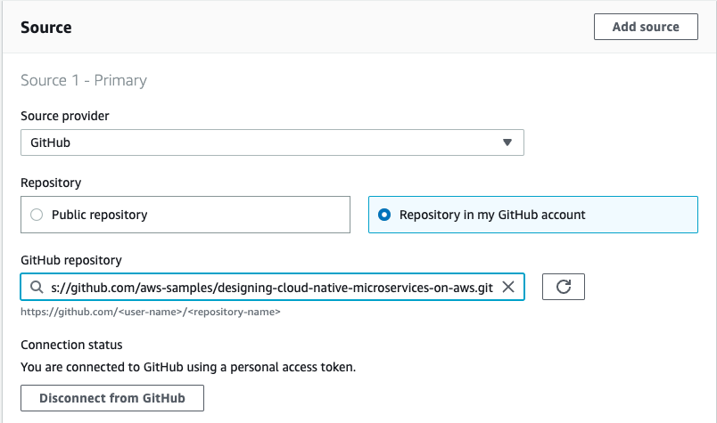

[< back to 04 Modeling and Development >](../04-modeling-and-development/README.md)

# Deploy CoffeeShop Application on Amazon EKS with Kubernetes

**Congratulations on your persistent learning journey! It's time to deploy the applications to a real AWS environment using modern cloud-native technologies.**


*The above diagram illustrates the complete EKS deployment architecture, showing the development workflow from source code to production deployment, including the hybrid EKS + Lambda approach for optimal performance and cost efficiency.*

This section covers deploying the CoffeeShop microservices to Amazon EKS (Elastic Kubernetes Service) using containerized deployment with ARM64 Graviton3 instances for optimal performance and cost efficiency.

## 📋 Architecture Flow Overview

### **Development to Deployment Pipeline**
1. **Developer** writes Java 21 + Spring Boot 3.4.1 code
2. **Build Process** compiles and creates ARM64 Docker images
3. **Amazon ECR** stores multi-architecture container images
4. **EKS Deployment** pulls images and runs microservices

### **Runtime Architecture**
- **Public Subnet**: ALB for external traffic, NAT Gateway for outbound connectivity
- **Private Subnet**: EKS cluster with Graviton3 nodes running microservices
- **Hybrid Computing**: EKS for core services + Lambda for event processing
- **Data Layer**: DynamoDB tables with EventBridge for event-driven communication

## 🚀 Current Deployment Architecture

### **Modern Cloud-Native Stack**
- **Container Orchestration**: Amazon EKS (Kubernetes 1.28)
- **Compute**: ARM64 Graviton3 instances (c7g.medium/large)
- **Application Runtime**: Java 21 + Spring Boot 3.4.1
- **Database**: Amazon DynamoDB (NoSQL)
- **Event Messaging**: Amazon EventBridge
- **Container Registry**: Amazon ECR
- **Load Balancing**: Application Load Balancer (ALB)

### **Why EKS over ECS?**
- **Kubernetes-Native**: Industry standard container orchestration
- **Multi-Cloud Portability**: Kubernetes runs anywhere
- **Rich Ecosystem**: Extensive tooling and community support
- **Advanced Scaling**: Horizontal Pod Autoscaler (HPA) and Cluster Autoscaler
- **Service Mesh Ready**: Native support for Istio, Linkerd
- **GitOps Integration**: ArgoCD, Flux for continuous deployment

## 📋 Prerequisites

To deploy applications to AWS EKS, you need the following essential tools installed:

### **Local Development Tools**
* [AWS CLI v2](https://docs.aws.amazon.com/cli/latest/userguide/getting-started-install.html) - AWS command line interface
* [kubectl](https://kubernetes.io/docs/tasks/tools/) - Kubernetes command line tool
* [eksctl](https://eksctl.io/installation/) - EKS cluster management tool
* [Docker Desktop](https://www.docker.com/products/docker-desktop/) - Container runtime
* [Java 21 JDK](https://docs.aws.amazon.com/corretto/latest/corretto-21-ug/downloads-list.html) - Amazon Corretto recommended
* [Gradle 8.13+](https://gradle.org/install/) - Build automation tool

### **AWS Account Requirements**
* AWS Account with administrative permissions
* AWS CLI configured with appropriate credentials
* Sufficient service limits for EKS, EC2, and DynamoDB


## 🛠️ Deployment Instructions

### **Step 1: Clone and Prepare the Repository**

```bash
# Clone the repository
git clone https://github.com/your-account/designing-cloud-native-microservices-on-aws.git
cd designing-cloud-native-microservices-on-aws

# Navigate to source code
cd sources/coffeeshop

# Verify Java version
java -version  # Should show Java 21

# Build all applications
./gradlew clean build
```

### **Step 2: Create Amazon EKS Cluster**

#### **Option A: Using eksctl (Recommended)**
```bash
# Create EKS cluster with Graviton3 ARM64 nodes
eksctl create cluster \
  --name coffeeshop-eks \
  --region us-west-2 \
  --nodegroup-name coffeeshop-graviton3-nodes \
  --node-type c7g.medium \
  --nodes 2 \
  --nodes-min 1 \
  --nodes-max 10 \
  --node-ami-family AmazonLinux2 \
  --node-ami-type AL2_ARM_64 \
  --managed

# Update kubeconfig
aws eks update-kubeconfig --region us-west-2 --name coffeeshop-eks

# Verify cluster access
kubectl get nodes
```

#### **Option B: Using AWS CDK (Advanced)**
```bash
# Navigate to CDK deployment
cd ../../deployment/coffeeshop-cdk-v2

# Install dependencies
npm install

# Deploy EKS infrastructure
cdk bootstrap aws://${AWS_ACCOUNT_ID}/us-west-2
cdk deploy CoffeeShopEKSStack
```

### **Step 3: Set Up Container Registry**

```bash
# Create ECR repositories for each microservice
aws ecr create-repository --repository-name coffeeshop/orders-web --region us-west-2
aws ecr create-repository --repository-name coffeeshop/coffee-web --region us-west-2
aws ecr create-repository --repository-name coffeeshop/inventory-web --region us-west-2

# Get ECR login credentials
aws ecr get-login-password --region us-west-2 | \
  docker login --username AWS --password-stdin \
  ${AWS_ACCOUNT_ID}.dkr.ecr.us-west-2.amazonaws.com
```

### **Step 4: Build and Push Multi-Architecture Container Images**

#### **Build Orders Service**
```bash
cd sources/coffeeshop/orders-web

# Build application JAR
../gradlew build

# Build ARM64 Docker image for Graviton3
docker build --platform linux/arm64 -t coffeeshop/orders-web:arm64 .

# Tag for ECR
docker tag coffeeshop/orders-web:arm64 \
  ${AWS_ACCOUNT_ID}.dkr.ecr.us-west-2.amazonaws.com/coffeeshop/orders-web:latest

# Push to ECR
docker push ${AWS_ACCOUNT_ID}.dkr.ecr.us-west-2.amazonaws.com/coffeeshop/orders-web:latest

cd ..
```

#### **Build Coffee Service**
```bash
cd coffee-web

# Build and push coffee service
../gradlew build
docker build --platform linux/arm64 -t coffeeshop/coffee-web:arm64 .
docker tag coffeeshop/coffee-web:arm64 \
  ${AWS_ACCOUNT_ID}.dkr.ecr.us-west-2.amazonaws.com/coffeeshop/coffee-web:latest
docker push ${AWS_ACCOUNT_ID}.dkr.ecr.us-west-2.amazonaws.com/coffeeshop/coffee-web:latest

cd ..
```

#### **Build Inventory Service**
```bash
cd inventory-web

# Build and push inventory service
../gradlew build
docker build --platform linux/arm64 -t coffeeshop/inventory-web:arm64 .
docker tag coffeeshop/inventory-web:arm64 \
  ${AWS_ACCOUNT_ID}.dkr.ecr.us-west-2.amazonaws.com/coffeeshop/inventory-web:latest
docker push ${AWS_ACCOUNT_ID}.dkr.ecr.us-west-2.amazonaws.com/coffeeshop/inventory-web:latest

cd ..
```


> Create build project


> Specify source, select github, and then **Click Connect to Github**


> Authorize AWS CodeBuild, click **Authorize aws-codesuite** and confirm **Password**


> Get connected with Github




**Now, your github account is get connected with aws-codesuite, you don't need to save this code project, just cancel it. These steps just for webhook authorization.**

-----

### Deploy infrastructure and Application with Code* family CI/CD pipeline by CDK

**By running this CDK application, You will get a standard VPC with 3 Availablity Zones environment, and one NATGateway serving private subnets.**

**Besides, in order to have an ease of use container orcheration service, an ECS Cluster with Fargate mode is also created.**

### Deploy Application by Code* family

```shell script
cd deployment/coffeeshop-cdk

npm install

npm run build 

cdk synth

cdk bootstrap aws://${your-aws-id}/${your-region-todeploy}

cdk deploy CoffeeShopCodePipeline 
```

**This workshop sample code is developed in Java8 with Quarkus Framework, Libs dependency managed by Maven. By running this CDK CoffeeShopCodePipeline stack, You will have:**

* ECR - Will create a Docker Image repository to serve Orders-Web application.
* CodeCommit Repository - for auto deployment
* CodeBuild - Get Github WebHooked project, build source code, build docker image, Push image to ECR,  deploy **Orders-web** Fargate Service, deploy **coffee-sls Lambda Function**, create **Dynamodb Table -{ Order, Coffee}**, create Event Rule in default **Amazon EventBridge** ..etc.


**Deploy Result**

```shell
Outputs:
CoffeeShopCodePipeline.CodeBuildProjectName = CodeBuildProject
CoffeeShopCodePipeline.AlbSvcServiceURL46A1D997 = http://Coffe-AlbSv-5MLHALGIGWUB-82783022.us-west-2.elb.amazonaws.com
CoffeeShopCodePipeline.AlbSvcLoadBalancerDNS20AA0F0B = Coffe-AlbSv-5MLHALGIGWUB-82783022.us-west-2.elb.amazonaws.com
CoffeeShopCodePipeline.Hint =
Create a "imagedefinitions.json" file and git add/push into CodeCommit repository "designing-cloud-native-microservices-on-aws
" with the following value:

[
  {
    "name": "defaultContainer",
    "imageUri": "123456789012.dkr.ecr.us-west-2.amazonaws.com/coffeeshop/orders-web:latest"
  }
]

CoffeeShopCodePipeline.Bucket = coffeeshop-nypea
CoffeeShopCodePipeline.CodeCommitRepoName = designing-cloud-native-microservices-on-aws
CoffeeShopCodePipeline.ServiceURL = http://Coffe-AlbSv-5MLHALGIGWUB-82783022.us-west-2.elb.amazonaws.com
CoffeeShopCodePipeline.StackName = CoffeeShopCodePipeline
CoffeeShopCodePipeline.StackId = arn:aws:cloudformation:us-west-2:584518143473:stack/CoffeeShopCodePipeline/f10c0520-0618-11ea-8122-023709c486f0

Stack ARN:
arn:aws:cloudformation:us-west-2:584518143473:stack/CoffeeShopCodePipeline/f10c0520-0618-11ea-8122-023709c486f0
```

Do remember to create a ["imagedefinitions.json"](https://docs.aws.amazon.com/codepipeline/latest/userguide/file-reference.html#pipelines-create-image-definitions) file and git add/push into CodeCommit repository "designing-cloud-native-microservices-on-aws
" (that has been created as part of the deployment above) with the following value:

```
[
  {
    "name": "defaultContainer",
    "imageUri": "your ecr repository arn for this coffeeshop/coffeeshop/orders-web:latest"
  }
]
```


### Way to Deploy applications 

You could deploy these applications via two approach: 

1. At first time, self manually deploy application in CodeBuild service, just to select the CodeBuild project and click the **start build** button, then the deployment process will be started.
2. Anytime, if you make any chang on the designing-cloud-native-microservices-on-aws repository on github, while you commit and push  to  master branch, then the CodeBuild service will automatically build it and trigger the codepipeline to deploy all these applications.

### Setup Lambda function trigger with EventBridge

```shell
targetArn=$(aws lambda get-function --function-name coffee-sls-OrderCreatedHandler | jq '.Configuration.FunctionArn')

aws events  put-targets --rule OrderCreatedRule --targets "Id"="OrderCreated","Arn"=$targetArn

ruleArn=$(aws events list-rules --name-prefix OrderCreatedRule | jq -r '.Rules[0].Arn')

aws lambda add-permission \
	--function-name coffee-sls-OrderCreatedHandler \
  --action lambda:InvokeFunction \
	--statement-id stat-coffee-sls \
  --principal events.amazonaws.com \
	--source-arn $ruleArn
```

### Run Test

**As all of the setting done, now you could hit the url which you created to make an coffee order:**

The **Orders-web** service endpoint is the Stack output - **CoffeeShopCodePipeline.AlbSvcServiceURLxxxx**

```shell
curl --header "Content-Type: application/json" \                                                                                            
        --request POST \
        --data '{"items":[{"productId":"5678","qty":2,"price":200}]}' \
        <<**CoffeeShopCodePipeline.AlbSvcServiceURLxxxx**>>/order

Result : 
{"items":[{"productId":"5678","qty":2,"price":200,"fee":400}],"status":0,"id":"ord-20191126-5906","createdDate":1574801783.400000000,"modifiedDate":null}
```

**Check the order table in DynamoDB**


**Check the lambda function(Order created event Handler) logs**

Visit Cloudwatch Service web page, search log groups : ***/aws/lambda/coffee-sls-OrderCreatedHandler***

```shell script
START RequestId: acfc1cf1-ba73-402e-921d-2fa2d95af5dc Version: $LATEST
2019-11-27 05:58:23 [main] INFO  solid.humank.coffeeshop.cofee.sls.orders.OrderCreatedHandler:39 - 0
2019-11-27 05:58:23 [main] INFO  solid.humank.coffeeshop.cofee.sls.orders.OrderCreatedHandler:40 - 7ebdf9f0-888d-540e-038d-bd6e25bea29f
2019-11-27 05:58:23 [main] INFO  solid.humank.coffeeshop.cofee.sls.orders.OrderCreatedHandler:41 - null
2019-11-27 05:58:23 [main] INFO  solid.humank.coffeeshop.cofee.sls.orders.OrderCreatedHandler:42 - solid.humank.coffeeshop.order
2019-11-27 05:58:23 [main] INFO  solid.humank.coffeeshop.cofee.sls.orders.OrderCreatedHandler:43 - 584518143473
2019-11-27 05:58:23 [main] INFO  solid.humank.coffeeshop.cofee.sls.orders.OrderCreatedHandler:44 - 2019-11-27T05:58:18Z
2019-11-27 05:58:23 [main] INFO  solid.humank.coffeeshop.cofee.sls.orders.OrderCreatedHandler:45 - us-west-2
2019-11-27 05:58:23 [main] INFO  solid.humank.coffeeshop.cofee.sls.orders.OrderCreatedHandler:46 - [Ljava.lang.String;@7ca48474
2019-11-27 05:58:23 [main] INFO  solid.humank.coffeeshop.cofee.sls.orders.OrderCreatedHandler:47 - 0
2019-11-27 05:58:23 [main] INFO  solid.humank.coffeeshop.cofee.sls.orders.OrderCreatedHandler:48 - bd56e57b-1575-49b0-b002-a8ef33c926a2
2019-11-27 05:58:23 [main] INFO  solid.humank.coffeeshop.cofee.sls.orders.OrderCreatedHandler:49 - 1
2019-11-27 05:58:23 [main] INFO  solid.humank.coffeeshop.cofee.sls.orders.OrderCreatedHandler:50 - EntityId(abbr=ord, seqNo=5907, occurredDate=2019-11-27T05:58:14.881Z)
2019-11-27 05:58:24 [main] DEBUG software.amazon.awssdk.request:84 - Sending Request: DefaultSdkHttpFullRequest(httpMethod=POST, protocol=https, host=dynamodb.us-west-2.amazonaws.com, encodedPath=/, headers=[amz-sdk-invocation-id, Content-Length, Content-Type, User-Agent, X-Amz-Target], queryParameters=[])
2019-11-27 05:58:27 [main] DEBUG software.amazon.awssdk.request:84 - Received successful response: 200
2019-11-27 05:58:27 [main] DEBUG software.amazon.awssdk.request:84 - Sending Request: DefaultSdkHttpFullRequest(httpMethod=POST, protocol=https, host=dynamodb.us-west-2.amazonaws.com, encodedPath=/, headers=[amz-sdk-invocation-id, Content-Length, Content-Type, User-Agent, X-Amz-Target], queryParameters=[])
2019-11-27 05:58:27 [main] DEBUG software.amazon.awssdk.request:84 - Received successful response: 200
Coffee made...
END RequestId: acfc1cf1-ba73-402e-921d-2fa2d95af5dc
REPORT RequestId: acfc1cf1-ba73-402e-921d-2fa2d95af5dc	Duration: 8150.39 ms	Billed Duration: 8200 ms	Memory Size: 512 MB	Max Memory Used: 156 MB	Init Duration: 887.71 ms
```

**Check the coffee table in DynamoDB**


Now, you have gone through all of the whole coffee ordering process journey, in case you would like to hands-on more, just implement more business scenario as you can, and taste all these **Cloud coffeeshop on AWS.**

